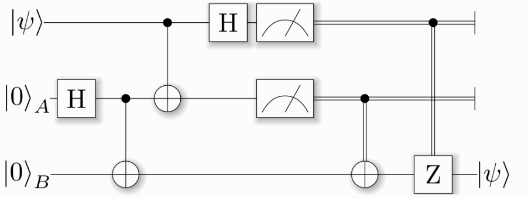
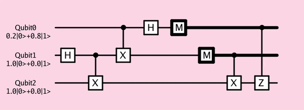

# Taichi-Q

基于taichi的量子计算模拟器

## 团队信息

+ 团队: **Administrator**
  + 成员：Harryhht

## 项目简介

### 灵感来源

量子计算Quantum Computation单纯是我个人兴趣，我在三年前在物理系就读的时候参加过一些相关的竞赛/黑客松，也自己粗浅地琢磨过某些算法。但因为量子计算和我目前的专业（BME）关联度不太大所以我对于其中更为前沿的研究内容缺乏一定认知还请谅解。设计一款量子计算模拟器一直是我的TODO栏中的一项，但苦于课业压力一直没抽出时间动手（也许是确实缺少动力）。Taichi我几年前就有所耳闻，和量子计算一样的TODO，一直没机会上手但有所关注，本次hackathon很好地提供了一次让我一次性达成两个目标的机会hhh。

顺便再稍微介绍一下量子计算模拟器。量子计算是一种不同于传统计算机的计算的计算机架构，相较于传统数字电路操纵的传统bit，量子计算机基于quantum bit (Qubit) 可以处于|0>与|1>的叠加态。量子计算的单元Quantum Gate也和数电中的与或非门不太一样，Quantum Gate本质上是酉矩阵，可对qubit作可逆的操作。同时，一些量子计算算法在时间复杂度上远胜于于传统算法，比如Grover搜索算法，Shor素数分解算法等。但是目前真正的量子计算机仍然在研究的初期快速增长阶段（以IBM为例，2019 Falcom: 27 qubits, 2020 Hummingbird 65 qubits, 2021 Eagle 127 qubits, 2022 Osprey 433 qubits)，同时目前量子计算机具有容易退相干和Gate精度等问题。目前大部分的量子计算算法研究都是先运行在由传统计算机模拟仿真的量子计算模拟器上，各厂商也有推出各自的量子计算语言和模拟器（IBM：ProjectQ, Microsoft: Q#, Google: CirQ）。借助模拟仿真我们可以在传统计算机上对量子算法的运行结果作出估计。对于量子计算底层原理的介绍详见下文。

<!-- Quantum Computation is one of my interest area. I've attempted some Quantum related Competitions and Hackathons during my college life and tried several opensource framework for quantum computation (e.g. Project Q from IBM, Q# from Microsoft), then I realized it's not that complicated to design framework on my own. On the other hand, I noticed that Taichi provided an elegant approach for code acceleration and useful sparse matrix supports, which is helpful for high-performance system design. So here comes the interesting project. -->

### 量子计算简介

#### 量子比特 [Qubit](https://github.com/bughht/Taichi-Q/tree/main/taichi_q/Qubit.py)

传统计算机中的比特只存在0和1两个状态，而在量子计算中，量子比特并非简单的0和1，$|0\rangle$ 和 $|1 \rangle$ 只是量子比特的两个基本状态。$| \rangle$是Dirac notation (物理学家使用的矢量标记)

对于一个Qubit，$|\psi\rangle$是$|0\rangle$和$|1 \rangle$两个状态的线性组合

$\psi\rangle = \alpha|0\rangle+\beta|1\rangle$

其中$\alpha$和$\beta$是复数，$|\alpha|^2$ 和 $|\beta|^2$描述0和1的概率，且对于单个qubit，$|\alpha|^2+|\beta|^2=1$。

Qubit在测量（measure/observe）后会坍缩为0或1，失去原有的qubit属性。

我们可以把qubit结构改写为$|\psi\rangle=e^{i\gamma}(\cos\frac{\theta}{2}|0\rangle+e^{i\phi}\sin\frac{\theta}{2}|1\rangle)$，$e^{i\gamma}$是全局相位，没有物理意义。

忽略后$|\psi\rangle=\cos\frac{\theta}{2}|0\rangle+e^{i\phi}\sin\frac{\theta}{2}|1\rangle$，可以将qubit映射到一个bloch sphere上。

不过Bloch Sphere仅能用于描述单量子比特，无法描述muti-qubits的情况。对于多量子比特，qubit中形成纠缠的情况更为复杂，比如当手头有两个量子比特的时候，可以用$|00\rangle |01\rangle |10\rangle |11\rangle$ 描述。
$|\psi\rangle=\alpha_{00}|00\rangle+\alpha_{01}|01\rangle+\alpha_{10}|10\rangle+\alpha_{11}|11\rangle$

其中中比较有趣的纠缠态Bell State，或者叫EPR State

$|\psi\rangle=\cfrac{|00\rangle+|11\rangle}{\sqrt{2}}$

两个qubit本质上是处于量子纠缠，当我们生成一组bell state对，我们可以把两个qubit放在很远的地方，当测量纠缠对中的一个qubit的结果，比如$|0\rangle$，另一个qubit的状态也会坍缩至$|0\rangle$。借助bell state我们可以设计很多使用的算法与工具，比如量子通信中的量子隐形传态。

而更多qubit的状态（如$|0\cdots0\rangle$)所具有的状态程指数增长，在taichi-Q中我们使用$2^{n_{qubit}}$的vector field来储存qubits的状态。在初始化Qubit的时候需要设定使用量子数与初始状态（默认为0），Qubit计算可选择运行于cpu或gpu上。在taichi_q中借助`taichi_q.Engine.qubits_init()`初始化。

#### 量子门电路 [Qubit Gate]([bughht/Taichi-Q: Quantum Computation Simulation Framework based on Taichi (github.com)](https://github.com/bughht/Taichi-Q/tree/main/taichi_q/Gate.py)

和数电一样，量子计算也有类似的电路设计，不过和传统bit门计算方式不太一样。量子门本质为酉矩阵变换qubits的状态，满足可逆的性质。

以下介绍的所有量子门电路都可采用`taichi_q.Gate.{the gate you want}()`调用，在taichi_q.Engine中使用`Ops({gate},{target},{control})`作用于目标量子比特和控制量子比特上。

##### 单量子比特门 single-qubit gate

*可能github没法很好地渲染矩阵，如果想深入看的话推荐下载readme*

对于单量子比特，如$|\psi\rangle=\alpha|0\rangle+\beta|1\rangle$，作用X门（非门）效果如下

$\begin{bmatrix}
  0&1\\
  1&0\\
\end{bmatrix}\begin{bmatrix}\alpha\\ \beta\end{bmatrix}=\begin{bmatrix}\beta\\ \alpha\end{bmatrix}$

$|0\rangle$和$|1\rangle$系数颠倒

结合Bloch球，我们可以把单量子比特描述为Bloch球在3度空间中的旋转变换

+ H门： $H=\frac{1}{\sqrt{2}}\begin{bmatrix}
  1&1\\
  1&-1\\
\end{bmatrix}$
+ X门： $X=\begin{bmatrix}
  0&1\\
  1&0\\
\end{bmatrix}$
+ Y门：$Y=\begin{bmatrix}
  0&-i\\
  i&0\\
\end{bmatrix}$
+ Z门：$Z=\begin{bmatrix}
  1&0\\
  0&-1\\
\end{bmatrix}$
+ S门：$S=\begin{bmatrix}
  1&0\\
  0&i\\
\end{bmatrix}$
+ T门：$T=\begin{bmatrix}
  1&0\\
  0&e^{\frac{\pi}{4}i}
\end{bmatrix}$
+ $R_x(\theta)$:绕X轴转动$\theta$ $R_x(\theta)=\begin{bmatrix}
  \cos(\theta/2)&i\sin(\theta/2)\\
  -i\sin(\theta/2)&\cos(\theta/2)\\
\end{bmatrix}$
+ $R_y(\theta)$:绕Y轴转动$\theta$ $R_y(\theta)=\begin{bmatrix}
  \cos(\theta/2)&-\sin(\theta/2)\\
  \sin(\theta/2)&\cos(\theta/2)\\
\end{bmatrix}$
+ $R_z(\theta)$:绕Z轴转动$\theta$ $R_z(\theta)=\begin{bmatrix}
  e^{-i\theta/2}&0\\
  0&e^{i\theta/2}\\
\end{bmatrix}$

##### 多量子比特门 muti-qubits gate

多量子比特门作用在多个量子比特上，其状态为多个量子比特的张量积(Kronecker product)。(这时候因为维度上去了bloch sphere就无法描述了)

+ CNOT门：$CNOT=\begin{bmatrix}
  1&0&0&0\\
  0&1&0&0\\
  0&0&0&1\\
  0&0&1&0\\
\end{bmatrix}$
  + $|00\rangle \rightarrow |00\rangle$
  + $|01\rangle \rightarrow |01\rangle$
  + $|10\rangle \rightarrow |11\rangle$
  + $|11\rangle \rightarrow |10\rangle$
+ C-U门（U可以为任意量子门）$C(U)=\begin{bmatrix}
  1&0&0&0\\
  0&1&0&0\\
  0&0&U_{00}&U_{01}\\
  0&0&U_{10}&U_{11}\\
\end{bmatrix}$
+ CC-NOT门 或者叫 Toffoli Gate (C也可以有若干个) $CCNOT=\begin{bmatrix}
  1&0&0&0&0&0&0&0\\
  0&1&0&0&0&0&0&0\\
  0&0&1&0&0&0&0&0\\
  0&0&0&1&0&0&0&0\\
  0&0&0&0&1&0&0&0\\
  0&0&0&0&0&1&0&0\\
  0&0&0&0&0&0&0&1\\
  0&0&0&0&0&0&1&0\\
\end{bmatrix}$

+ QFT门 iQFT门：
  + 由于DFT是酉变换，其变换矩阵可作为量子门使用（在Shor算法中十分重要）

#### 测量

测量本质上会将qubit从叠加态映射到bit的单一态，和量子门变换不同，是一个不可逆的过程，因此测量的映射矩阵并非酉矩阵。

在taichi_q中使用`taichi_q.Engine.Measure(target)`可观测特定qubit并使其状态坍缩。

#### 量子电路可视化

在taichi_q中使用`taichi_q.Engine.visualize`显示当前操作下的量子电路

以下为同一电路在ProjectQ和taichi-q中的可视化

from ProjectQ

from Qiskit

from taichi-q

#### 量子算法：(代码要写不完辣，我直接搬辣)

在开发好的量子模拟器上编写

##### [Quantum Teleportation](https://qiskit.org/textbook/ch-algorithms/teleportation.html#4.-Understanding-Quantum-Teleportation-)

##### [Grover Algorithm](https://qiskit.org/textbook/ch-algorithms/grover.html)

### Goals

+ [x] Quantum Circuit Components
  + [x] Qubit
  + [x] Quantum Gates
  + [x] Measure
+ [x] Quantum Simulation Engine
+ [x] Visualization
  + [x] Quantum Circuit
  + [x] Result
+ [x] Implement some Quantum Algorithms (Grover, etc.)
  + [x] Teleportation
  + [x] Grover
+ [x] Publish the Taichi-Q Package
